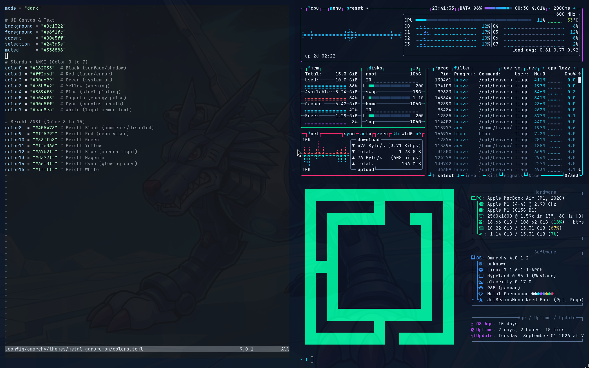

# 🐺 Metal Garurumon Theme for Omarchy

A cold steel, cybernetic dark theme for [Omarchy](https://omarchy.org/) Linux inspired by **Metal Garurumon** (Digimon).

Featuring a midnight steel canvas, laser-pulse magenta, cyber green, glowing armor blues, and piercing cyan (*Cocytus Breath*) accents.



---

## 📋 Features

- **Cybernetic Color Palette**: Dark navy/steel canvas (`#0c1322`), high-contrast light armor text (`#e6f1fc`), and vibrant neon accents (Cocytus cyan, laser red/magenta, system green).
- **Desktop-Wide Theming**: Automatically generated and coordinated across:
  - **Hyprland** (window borders, active/inactive states)
  - **Omarchy Shell** (Quickshell status bar, widgets, OSD, lock screen)
  - **Terminals** (Alacritty, Foot, Kitty, Ghostty)
  - **Text Editors & CLI Tools** (Neovim, Btop, Starship, Helix, Lazygit)
  - **GUI Applications** (Chromium / Web browsers, VS Code, GNOME interface)
- **Matching Wallpapers**: Ships with high-resolution Metal Garurumon wallpapers (`backgrounds/metal-garurumon.jpg`, `backgrounds/metal-garurumon-2.jpg`).
- **Cinematic Screensaver**: 3-act terminal screensaver animation featuring the Digivice invocation, Metal Garurumon evolution, and Omarchy particle convergence.
- **Icon Set**: Configured to pair seamlessly with `Yaru-blue`.

---

## ⚡ Quick Install (Recommended)

Omarchy has a built-in theme manager that can install themes directly from Git repositories.

Run the following command in your terminal:

```bash
omarchy theme install https://github.com/iamtiagomadeira/omarchy-metal-garurumon-theme
```

### What this does automatically:
1. Clones the repository into `~/.config/omarchy/themes/metal-garurumon`.
2. Omarchy verifies and stages the color palette and assets.
3. Automatically sets and applies `metal-garurumon` across your entire desktop environment.

---

## 🛠️ Manual Installation

If you prefer to install manually via Git:

### 1. Clone into your Omarchy themes folder
```bash
git clone https://github.com/iamtiagomadeira/omarchy-metal-garurumon-theme.git ~/.config/omarchy/themes/metal-garurumon
```

### 2. Apply the theme
```bash
omarchy theme set metal-garurumon
```

---

## 🎮 Usage & Useful Commands

### Switch to the Theme
```bash
omarchy theme set metal-garurumon
```

### Open the Interactive Theme Switcher
Omarchy provides a graphical menu to preview and select themes:
```bash
omarchy theme switcher
```

### Check Current Theme
```bash
omarchy theme current
```

### List Installed Themes
```bash
omarchy theme list
```

### Refresh Current Theme
If you customize `colors.toml` and want to re-render all application templates:
```bash
omarchy theme refresh
```

---

## 🖼️ Wallpaper Management

The theme includes wallpapers in `backgrounds/`:
- `metal-garurumon.jpg`
- `metal-garurumon-2.jpg`

- **Cycle through backgrounds:**
  ```bash
  omarchy theme bg next
  ```
- **Open visual wallpaper switcher:**
  ```bash
  omarchy theme bg-switcher
  ```
- **Add your own wallpapers for this theme:**
  Place additional images (`.jpg`, `.png`, `.webp`) into:
  ```
  ~/.config/omarchy/themes/metal-garurumon/backgrounds/
  ```
  or into your user override folder:
  ```
  ~/.config/omarchy/backgrounds/metal-garurumon/
  ```

---

## 🔄 Updating the Theme

To pull the latest updates for all git-installed themes on Omarchy:

```bash
omarchy theme update
```

Or update this specific theme repository directly:

```bash
cd ~/.config/omarchy/themes/metal-garurumon
git pull
omarchy theme set metal-garurumon
```

---

## 🗑️ Uninstallation

To switch to another theme and remove Metal Garurumon:

1. **Switch to another theme:**
   ```bash
   omarchy theme set catppuccin
   # or tokyo-night, everforest, gruvbox, etc.
   ```

2. **Remove the theme:**
   Using Omarchy's interactive theme removal tool:
   ```bash
   omarchy theme remove metal-garurumon
   ```
   *Or remove the folder manually:*
   ```bash
   rm -rf ~/.config/omarchy/themes/metal-garurumon
   ```

---

## 🎨 Color Palette Reference

| Key | Hex | Description / Concept |
| :--- | :--- | :--- |
| `background` | `#0c1322` | Deep midnight steel navy canvas |
| `foreground` | `#e6f1fc` | Crisp light armor text |
| `accent` | `#00e5ff` | Neon Cyan (*Cocytus Breath*) |
| `selection` | `#243a5e` | Steel blue selection highlight |
| `muted` | `#536888` | Muted cyber gray-blue |
| `color0` | `#162035` | Surface / dark shadow |
| `color1` | `#ff2a6d` | Laser red / error indicator |
| `color2` | `#00e699` | Cyber green / system normal |
| `color3` | `#e5b842` | Warning amber yellow |
| `color4` | `#3894f5` | Steel plating blue |
| `color5` | `#c044f5` | Energy pulse magenta |
| `color6` | `#00e5ff` | Cocytus cyan |
| `color7` | `#cad8ea` | Light armor white |
| `color8` | `#405473` | Bright black / comment text |
| `color9` | `#ff5792` | Neon visor red |
| `color10` | `#33ffb8` | Bright system green |
| `color11` | `#ffe066` | Bright warning yellow |
| `color12` | `#67b2ff` | Aurora blue light |
| `color13` | `#da77ff` | Bright energy magenta |
| `color14` | `#66f0ff` | Glowing core cyan |
| `color15` | `#ffffff` | Pure white |

---

## 📁 Repository Structure

```
omarchy-metal-garurumon-theme/
├── backgrounds/
│   ├── metal-garurumon.jpg   # Primary desktop wallpaper
│   └── metal-garurumon-2.jpg # Alternate desktop wallpaper
├── screensaver/
│   ├── 01-digivice.txt        # Act I: Digivice Invocation
│   ├── 02-metal-garurumon.txt # Act II: Metal Garurumon Evolution
│   └── 03-omarchy.txt         # Act III: Omarchy Particle Convergence
├── colors.toml               # Core Omarchy palette configuration
├── icons.theme               # Icon theme declaration (Yaru-blue)
├── preview.png               # Theme screenshot preview
└── README.md                 # Documentation & installation guide
```

---

## ❓ Troubleshooting

- **Terminals didn't update colors?**
  Run:
  ```bash
  omarchy restart terminal
  ```
- **Bar or notifications didn't refresh?**
  Run:
  ```bash
  omarchy restart shell
  ```
- **Check where Omarchy found the theme directory:**
  ```bash
  omarchy theme dir metal-garurumon
  ```
